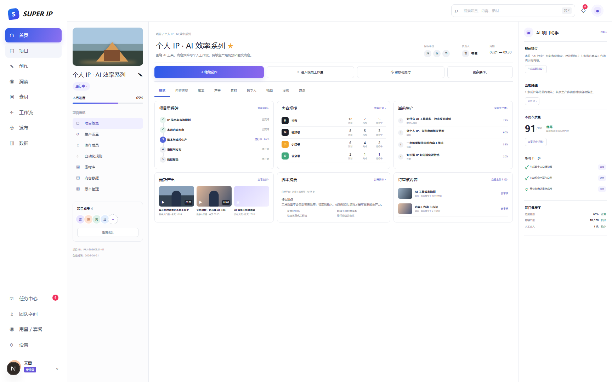
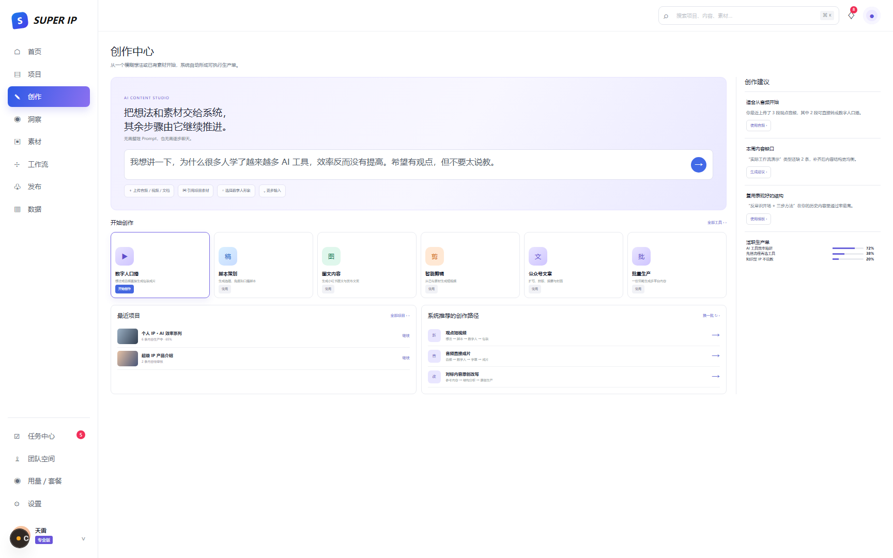
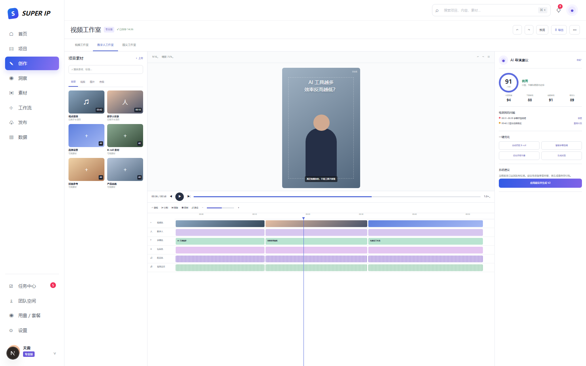
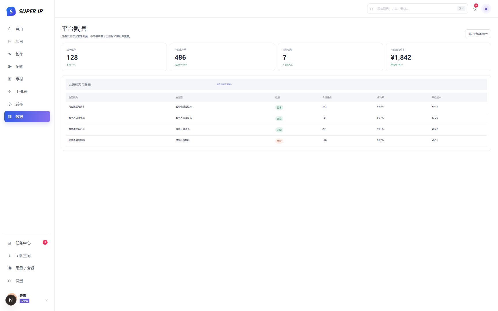

# 星流 AI：非对话式智能体产品与底层架构执行说明书 V4

> 日期：2026-08-21  
> 状态：架构基线 / 可执行工程文档  
> 当前阶段：整体架构设计；首期聚焦「IP 内容策划 → 数字人口播 → 后期包装 → 成片审核」  
> 方法：两版外部报告只作为输入。本说明书以当前源码、用户确认、真实可行性和外部技术资料为准重新判断。

---

## 0. 结论

### 0.1 最终产品是什么

星流 AI 最终不是聊天机器人，也不是若干 AI 工具的导航站，而是一个**面向超级 IP 的自主内容生产操作系统**。

客户可以只提供：

- 一个模糊想法；
- 一段自己的观点音频；
- 若干参考视频、图片、文档或链接；
- 已有数字人形象、声音和品牌素材；
- 期望交付的平台、数量、时间和自动程度。

系统把输入整理为一张可追踪的「生产单」，自主完成：

~~~text
需求理解
  → 内容策略与选题
  → 口播脚本
  → 声音处理或生成
  → 数字人口播
  → 字幕 / B-roll / 封面 / 节奏包装
  → 质量检查
  → 用户选定的确认点
  → 成片与发布包
~~~

用户不需要持续聊天，也不需要逐步命令 AI。用户只在发起时设置目标和自动策略，系统在被允许的范围内持续推进。

### 0.2 已锁定的架构决定

1. 主业务对象是 Project + ProductionOrder + ArtifactVersion，不是 Chat 或 Prompt。
2. Agent Runtime 负责理解、规划、评估与重规划；Durable Workflow 负责可靠执行。
3. 客户前端不显示 Provider、模型、路由、Worker 和原始任务状态。
4. 云端能力通过通用 Capability / Provider Gateway 接入；Duix 和 OpenTalking 不再成为核心架构前提。
5. 平台需要独立管理后台，供开发和运营管理租户、能力、任务、成本、质量与审计。
6. 第一阶段只做一条黄金任务闭环，不铺开所有内容形态和发布渠道。

### 0.3 现在是否已经能接其他云端 API

**结论：具备继续扩展适配器的代码基础，但尚不具备平台化接入任意云 API 的产品能力。**

当前已有：

- Provider 基类与 Registry；
- Duix / OpenTalking 适配器位置；
- 路由决策记录；
- 异步任务、步骤与重试；
- Provider 探测页面。

当前仍缺：

- 通用 Provider 定义与能力合同；
- 后台创建、测试、启停、灰度和回滚连接；
- 租户级 / 平台级连接边界；
- Secret Vault 或密钥引用；
- OAuth、API Key、签名、Webhook 等认证模式；
- Callback / Polling 的统一转换；
- 速率限制、并发、预算、用量和计费；
- 质量与健康驱动的动态路由；
- Provider 版本发布和审计；
- 不修改客户前端类型即可增加新 Provider 的能力。

当前请求类型仍硬编码为：

~~~text
provider: auto | duix | opentalking
~~~

因此现状不能被表述为“已经能在后台自由接其他云端 API”。V4 把通用 Provider Control Plane 定义为核心底座。

---

## 1. 产品边界

### 1.1 一句话定位

> 用户交付意图和素材，系统交付可审核、可追溯、可发布的 IP 内容成品。

产品不是：

- 以聊天为首页的通用助手；
- 让用户自行选择模型和 Provider 的工具箱；
- 单一数字人生成器；
- 多个静态页面拼接的 SaaS Demo；
- 用前端倒计时模拟长任务；
- 一次生成后无法修改、恢复和追责的黑盒。

### 1.2 两类顶层用户

| 顶层用户 | 目标 | 产品表面 |
|---|---|---|
| 产品客户 | 生产自己的 IP 内容 | 项目、创作、素材、工作流、审核、发布、复盘 |
| 平台开发与运营 | 让 SaaS 稳定、可控、可盈利 | 租户、能力、任务、成本、质量、配置、审计 |

客户组织内部未来可以有 Owner、Editor、Reviewer 等权限，但它们仍属于同一顶层用户类别。

### 1.3 首期范围

~~~text
模糊想法 / 音频 / 素材
    ↓
内容策略和口播脚本
    ↓
数字人口播
    ↓
基础后期包装
    ↓
最终审片与成品交付
~~~

首期不同时实现：

- 全平台内容洞察；
- 所有图文和文章形态；
- 自动发布全部平台；
- 完整效果归因；
- Agent 商店；
- 通用无代码工作流编辑器；
- Duix / OpenTalking 双引擎生产；
- 全量微服务拆分。

---

## 2. 当前源码审计

### 2.1 可复用基础

| 现有位置 | 可复用内容 |
|---|---|
| backend/app/models/orchestration.py | 工作流、步骤、Provider Job、路由决策的初步对象 |
| backend/app/services/workflow_service.py | 幂等创建、步骤初始化、重试入口 |
| backend/app/services/provider_registry.py | Provider 注册和路由雏形 |
| backend/app/providers/ | Adapter 边界 |
| backend/app/schemas/business.py | IP、Campaign、ContentProject 的早期对象 |
| app/lib/api.ts | 前后端调用集中入口 |
| app/components/task-center.tsx | 真实状态和失败重试的最小页面 |

### 2.2 当前交互为什么不对

当前链路是：

~~~text
IP 大脑
  → 营销活动
  → 内容工作室
  → 用户手工确定平台和角度
  → 本地模板拼脚本
  → 用户手工送入数字人工作室
  → 用户选择 Duix / OpenTalking
  → 用户去任务中心
  → 用户去发布与复盘
~~~

根本问题：

1. 页面按工具分区，生产不是一个连续对象。
2. AI 没有真正拥有任务；当前 buildDraft() 只是前端本地模板。
3. 用户承担内部编排工作。
4. Campaign、ContentProject、WorkflowRun 和前端临时状态没有统一事实来源。
5. 客户看到路由和 Provider，而不是内容方案、版本、质量和成片。

### 2.3 数据与权限缺口

- 固定 X-Owner-Id: local-user，不是真实身份；
- 业务对象缺少统一 tenant_id；
- 资产结果暴露 Provider 路径；
- IP 有版本号，但项目未引用不可变 Snapshot；
- ContentProject 直接覆盖 script，没有 ScriptVersion；
- WorkflowRun 只有数字人口播三步，不是通用 Agent Plan；
- 没有跨租户隔离测试；
- 没有平台员工权限和强审计。

---

## 3. 非对话式交互

### 3.1 客户只看到五类 AI 交互

| 交互 | 含义 |
|---|---|
| 一句话 / 素材输入 | 用户描述目标，不要求写 Prompt |
| 生产方案 | 系统展示结构化理解和执行方案 |
| 生产进度 | 展示业务阶段、预计时间和当前结果 |
| 决策请求 | 只在预设检查点或异常时打扰用户 |
| 产物版本 | 脚本、声音、视频、封面和发布文案可比较、审核、回退 |

不得把模型思维过程、内部多轮对话或工具日志直接展示给客户。

### 3.2 自动程度由用户选择

| 模式 | 正常暂停点 | 场景 |
|---|---|---|
| 多确认 | 方案、脚本、声音、初版、最终成片 | 第一次使用、高风险内容 |
| 关键处确认（默认） | 内容方案、最终成片 | 普通生产 |
| 自动完成 | 只在权利、超预算、质量连续失败、外部发布时暂停 | 稳定重复任务 |

每张生产单保存：

- 自动模式；
- 检查点规则；
- 外部副作用策略；
- 成本上限；
- 自动重做次数；
- 权利和合规约束；
- 超时与终止规则。

### 3.3 DecisionRequest，不是聊天

~~~json
{
  "reason_code": "FINAL_VIDEO_REVIEW",
  "title": "确认最终成片版本",
  "summary": "V2 已修复背景音乐和两处字幕停留问题",
  "options": [
    {"key": "approve_v2", "label": "采用 V2 并交付"},
    {"key": "open_review", "label": "打开审片"},
    {"key": "return_caption", "label": "只重做字幕包装"}
  ],
  "recommended_option": "approve_v2",
  "blocking": true
}
~~~

选择结果进入 Workflow Event History，继续执行；不追加为聊天历史。

---

## 4. 最终前端形态

### 4.1 视觉语言

本版借鉴用户提供参考图的感觉：

- 浅色桌面 SaaS；
- 固定全局左侧导航；
- 高信息密度、细边框、清楚的区域层次；
- 蓝紫色用于选中态和主操作；
- 项目页允许第二层项目导航；
- 工作室采用素材区、中央编辑区、AI 检查区三栏；
- AI 建议固定在右侧，是上下文助手，不是聊天窗口。

不复制参考产品的品牌、文案和独特素材。

### 4.2 客户一级导航

~~~text
首页
项目
创作
洞察       后续开放
素材
工作流
发布       后续开放
数据       后续开放
~~~

首期正式开放：首页 / 项目、创作、素材、黄金工作流、视频工作室、成片审核与下载。

### 4.3 UI 01：项目总览

项目总览统一回答：

1. 项目目标是什么；
2. 已经生产到哪里；
3. 已完成哪些产物；
4. 是否需要用户决策。

右侧 AI 项目助手只显示建议、提醒、质量、下一步和健康度，不显示工程细节。

### 4.4 UI 02：创作中心

主要入口是一条“想法 / 素材输入”，但不是聊天：

- 提交后创建 ProductionOrder；
- 不形成长期聊天线程；
- 系统返回结构化生产方案；
- 页面可以离开；
- 长任务在后台继续；
- 只在选定检查点通知。

### 4.5 UI 03：视频工作室

| 区域 | 职责 |
|---|---|
| 左侧素材区 | 观点音频、数字人形象、B-roll、品牌素材 |
| 中央编辑区 | 成片预览、字幕、数字人、包装、音频时间线 |
| 右侧 AI 导演 | 质量分、问题定位、一键优化、最终建议 |

AI 后期包装默认自动完成；工作室用于审片、局部修改和人工接管，不要求用户从空白时间线开始剪辑。

### 4.6 UI 04：平台数据

这是平台开发和运营入口。客户看不到跨租户数据、云服务、路由、成本、失败队列、系统配置和审计。

### 4.7 本地可点击原型

~~~text
http://localhost:3001/prototype
http://localhost:3001/prototype?view=create
http://localhost:3001/prototype?view=studio
http://localhost:3001/prototype?view=admin
~~~

代码：

~~~text
app/prototype/page.tsx
app/prototype/prototype-client.tsx
app/prototype/prototype.module.css
~~~

---

## 5. 目标架构

~~~mermaid
flowchart LR
  subgraph Customer[客户产品]
    Home[项目 / 创作 / 素材]
    Review[审核 / 版本 / 成品]
  end
  subgraph App[SaaS 应用平面]
    API[Business API]
    Tenant[Tenant / Identity / Policy]
    Assets[Asset / Consent / Artifact]
  end
  subgraph Agent[Agent 决策平面]
    Context[Context Assembler]
    Planner[Planner]
    Policy[Policy Engine]
    Eval[Evaluator / Replanner]
  end
  subgraph Workflow[可靠执行平面]
    Run[Durable Workflow]
    Queue[Outbox / Queue / Lease]
    Worker[Workers]
  end
  subgraph Capability[能力与云服务平面]
    Registry[Capability Registry]
    Gateway[Provider Gateway]
    Cloud[LLM / Audio / Avatar / Media APIs]
  end
  subgraph Control[平台控制平面]
    Admin[Platform Admin]
    Billing[Usage / Cost / Quota]
    Ops[Quality / Audit / Operations]
  end
  Home --> API --> Agent
  Agent --> Workflow --> Gateway --> Cloud
  Worker --> Assets
  Review --> API
  Admin --> Control
  Control --> Tenant
  Control --> Gateway
  Control --> Workflow
~~~

| 平面 | 负责 | 不负责 |
|---|---|---|
| SaaS 应用平面 | 租户、项目、生产单、资产、版本、审核 | 决定下一步怎么做 |
| Agent 决策平面 | 理解目标、计划、评估、重规划 | 长任务可靠性和 Provider 原始状态 |
| Workflow 执行平面 | 步骤、依赖、恢复、重试、取消、检查点 | 自由修改业务目标 |
| 平台控制平面 | 租户、能力、连接、路由、成本、质量、审计 | 客户内容创作交互 |

---

## 6. Agent Runtime

一次 Agent Run 至少包含：

~~~text
Context
  → Plan
  → Policy Check
  → Execute
  → Observe
  → Evaluate
  → Replan or Finish
~~~

如果后端只有 prompt → provider.call() → result，它只是模型调用，不是本产品需要的 Agent Runtime。

| 组件 | 职责 |
|---|---|
| Context Assembler | 读取项目、IP Snapshot、素材、历史通过版本、约束和成本 |
| Intent Interpreter | 把模糊输入转成 IntentSpec，并标注推断和置信度 |
| Planner | 生成依赖、预期产物、评价器和预算 |
| Policy Engine | 判断自动执行或请求确认 |
| Supervisor | 选择下一步并监控结果 |
| Evaluator | 评价脚本、声音、画面、包装和成片 |
| Replanner | 局部失败或质量不达标时创建新 PlanVersion |
| Memory Writer | 只把经批准的稳定偏好写回 IP Memory |

Context 分层：

~~~text
Global Policy
Tenant Policy
Project Snapshot
IP Profile Snapshot
Production Order Intent
Selected Assets
Approved Historical Artifacts
Current Plan / Run State
~~~

Planner 输出示例：

~~~json
{
  "goal": "生成 1 条可发布的 9:16 数字人口播",
  "success_criteria": [
    "观点与 IP 定位一致",
    "脚本 45–65 秒",
    "声音质量通过",
    "数字人口型与身份通过",
    "字幕和包装通过"
  ],
  "steps": [
    {
      "key": "strategy.generate",
      "capability": "content.strategy",
      "depends_on": [],
      "expected_artifact": "strategy_proposal",
      "evaluator": "strategy_quality_v1",
      "checkpoint": "policy"
    }
  ],
  "budget_estimate": 6.20,
  "termination_policy": "all_required_artifacts_approved"
}
~~~

---

## 7. Durable Workflow

模型可以决定“下一步做什么”，但工作流必须保证：

- 进程崩溃后恢复；
- 重复请求不重复扣费；
- Provider 延迟或回调乱序不污染状态；
- 暂停、取消和局部重做可执行；
- 版本不静默覆盖；
- 长任务不依赖浏览器在线。

OpenAI Background Mode 能异步提交模型任务并查询状态，但它只覆盖单个模型响应，不替代跨 Provider 业务工作流。[OpenAI Background Mode](https://developers.openai.com/api/docs/guides/background)

Temporal 将 Workflow Execution 定义为可持久、可恢复的执行单元。V4 采用同类可靠性合同，但首期不强制引入 Temporal。[Temporal Workflow Execution](https://docs.temporal.io/workflow-execution)

首期在 FastAPI + PostgreSQL + Redis 上补齐：

- Transactional Outbox；
- Worker Lease / Heartbeat / Reaper；
- Idempotency Key；
- Step Attempt / Retry Policy；
- Checkpoint / Event History；
- Artifact Version；
- Cancel / Pause；
- Webhook 去重；
- Usage Ledger。

状态机：

~~~text
draft → planning → awaiting_plan_approval → queued → running
      → awaiting_decision → evaluating → succeeded

异常分支：
retry_wait / paused / canceling / canceled
failed_retryable / failed_final / manual_intervention
~~~

用户确认、修改约束、取消和重做必须进入事件历史。Temporal 的 Query、Signal、Update 模型可作为读取、异步命令和需确认命令的参考。[Temporal Workflow Message Passing](https://docs.temporal.io/encyclopedia/workflow-message-passing)

---

## 8. Capability / Provider Gateway

两层抽象：

~~~text
Business Step → Capability → Provider Connection
~~~

示例：

~~~text
script.generate → content.generate → 通用模型通道 A
audio.clean     → audio.enhance    → 语音云通道 A
avatar.render   → avatar.render    → 数字人云通道 A
video.compose   → video.compose    → 媒体处理集群
~~~

客户业务对象只引用 Capability，不引用供应商。

| 对象 | 说明 |
|---|---|
| CapabilityDefinition | 能力名称、输入输出 Schema、版本和限制 |
| ProviderDefinition | 厂商与 Adapter 类型 |
| ProviderConnection | 端点、区域、租户范围、认证引用 |
| SecretRef | Vault 中的密钥引用 |
| CapabilityBinding | 一个连接能提供哪些能力 |
| RoutePolicy | 优先级、质量、成本、区域、回退 |
| ProviderJob | 原始请求、外部任务 ID、加密元数据 |
| UsageRecord | Token、秒数、分钟数、图片数和费用 |
| ProviderRelease | Adapter 版本、测试、灰度和回滚 |

后台必须支持：

1. 创建连接；
2. 选择能力；
3. 配置端点和认证；
4. 连接测试；
5. 契约样例测试；
6. 设置租户、区域、成本和并发；
7. 灰度启用；
8. 查看成功率、延迟和失败分类；
9. 回滚或停用；
10. 审计高风险操作。

Duix / OpenTalking 如果未来重新采用，只是 avatar.render 的 Provider Adapter，不进入客户导航和业务 Schema。

---

## 9. 多租户 SaaS

每个请求、队列消息、事件、对象存储路径和用量记录都必须带 tenant_id。

~~~text
Authenticated Principal
  → Tenant Membership
  → Tenant Context
  → Policy / Data Scope / Budget
~~~

认证和授权不自动等于租户隔离。租户隔离必须独立使用 tenant context 限制资源访问。[AWS Tenant Isolation](https://docs.aws.amazon.com/whitepapers/latest/saas-architecture-fundamentals/tenant-isolation.html)

首期隔离策略：

- PostgreSQL 共享库、共享 Schema；
- 租户表强制 tenant_id NOT NULL；
- Repository 自动注入 TenantScope；
- PostgreSQL RLS 作为第二道边界；
- 对象路径 tenant/{tenant_id}/project/{project_id}/...；
- 下载使用短期签名 URL；
- 队列消息带 tenant_id，Worker 再校验；
- 平台员工跨租户读取需要单独权限和审计。

AWS 将租户入驻、身份、管理、运营和分析归入 SaaS 控制平面；客户业务功能属于应用平面。V4 采用这一分离。[AWS Control Plane vs. Application Plane](https://docs.aws.amazon.com/whitepapers/latest/saas-architecture-fundamentals/control-plane-vs.-application-plane.html)

---

## 10. 核心数据模型

~~~mermaid
erDiagram
  TENANT ||--o{ MEMBERSHIP : has
  USER ||--o{ MEMBERSHIP : joins
  TENANT ||--o{ PROJECT : owns
  PROJECT ||--o{ PRODUCTION_ORDER : contains
  PROJECT ||--o{ IP_PROFILE_SNAPSHOT : references
  PRODUCTION_ORDER ||--o{ AGENT_RUN : plans
  AGENT_RUN ||--o{ PLAN_VERSION : versions
  PLAN_VERSION ||--o{ WORKFLOW_STEP : executes
  PRODUCTION_ORDER ||--o{ DECISION_REQUEST : pauses
  PRODUCTION_ORDER ||--o{ ARTIFACT : creates
  ARTIFACT ||--o{ ARTIFACT_VERSION : versions
  PRODUCTION_ORDER ||--o{ ASSET_REF : uses
  ASSET ||--o{ ASSET_REF : referenced
  ASSET ||--o{ CONSENT_SNAPSHOT : governed_by
  WORKFLOW_STEP ||--o{ PROVIDER_JOB : dispatches
  PROVIDER_CONNECTION ||--o{ PROVIDER_JOB : runs
  PROVIDER_JOB ||--o{ USAGE_RECORD : meters
  ARTIFACT_VERSION ||--o{ QUALITY_EVALUATION : evaluated
~~~

| 对象 | 业务语义 |
|---|---|
| Project | 长期 IP 系列、活动或内容目标 |
| ProductionOrder | 一次可独立追踪的生产请求 |
| ContentItem | 一条内容的业务身份 |
| AgentRun | 围绕目标的决策运行 |
| PlanVersion | 不可变计划版本 |
| WorkflowStep | 可靠执行步骤 |
| Asset | 原始或生成素材 |
| Artifact / ArtifactVersion | 脚本、音频、视频、封面、文案及其版本 |
| DecisionRequest | 结构化暂停 |
| ProviderJob | 外部云端或 Worker 原始任务 |
| QualityEvaluation | 机器或人工评价 |

---

## 11. API 与事件

客户 API：

~~~text
POST   /v1/projects
GET    /v1/projects/{project_id}/overview
POST   /v1/production-orders
GET    /v1/production-orders/{order_id}
POST   /v1/production-orders/{order_id}/pause
POST   /v1/production-orders/{order_id}/resume
POST   /v1/production-orders/{order_id}/cancel
GET    /v1/production-orders/{order_id}/decisions
POST   /v1/decisions/{decision_id}/resolve
GET    /v1/artifacts/{artifact_id}/versions
POST   /v1/artifact-versions/{version_id}/approve
POST   /v1/artifact-versions/{version_id}/return
POST   /v1/assets
GET    /v1/assets/{asset_id}
~~~

平台 API：

~~~text
GET    /v1/admin/tenants
GET    /v1/admin/runs
POST   /v1/admin/runs/{run_id}/intervene
GET    /v1/admin/capabilities
POST   /v1/admin/provider-connections
POST   /v1/admin/provider-connections/{id}/test
POST   /v1/admin/provider-connections/{id}/publish
POST   /v1/admin/provider-connections/{id}/disable
GET    /v1/admin/route-policies
POST   /v1/admin/route-policies/{id}/publish
GET    /v1/admin/usage
GET    /v1/admin/quality
GET    /v1/admin/audit-events
~~~

核心事件：

~~~text
production_order.created
intent_spec.created
agent_run.started
plan.version.created
plan.approved
workflow_step.ready / started / succeeded / failed
decision.requested / resolved
artifact.version.created / evaluated / approved
provider_job.submitted / updated / terminal
usage.recorded
production_order.succeeded / failed
~~~

---

## 12. 黄金任务与局部重做

计划：

~~~text
intent.normalize
→ strategy.generate
→ strategy.evaluate
→ checkpoint.strategy
→ script.generate
→ script.evaluate
→ audio.prepare
→ audio.evaluate
→ avatar.render
→ avatar.evaluate
→ video.compose
→ video.evaluate
→ checkpoint.final
→ delivery.package
~~~

| 修改 | 重跑范围 |
|---|---|
| 修改核心观点 | 从 strategy.generate 建新分支 |
| 修改脚本句子 | 从 audio.prepare 开始 |
| 换音频 | 从 audio.evaluate 或 avatar.render 开始 |
| 修口型 | 只重跑对应 avatar 片段 |
| 改字幕样式 | 只重跑 video.compose |
| 改封面 | 只重跑 cover 子步骤 |

任何修改都创建新版本，不覆盖已批准产物。

---

## 13. 质量、成本与可观测性

| 层级 | 示例 |
|---|---|
| 输入质量 | 音频信噪比、形象授权、素材格式 |
| 内容质量 | 观点清晰、IP 一致、平台适配、事实边界 |
| 声音质量 | 响度、噪声、停顿、文本匹配 |
| 数字人质量 | 身份、口型、表情、稳定性、画面缺陷 |
| 包装质量 | 字幕安全区、节奏、B-roll、封面 |
| 业务质量 | 一次通过率、人工介入、用户最终选择 |

首期指标：

- Time to First Approved Deliverable；
- 生产单端到端成功率；
- 步骤重试率；
- 首稿通过率；
- 成片一次通过率；
- 人工介入率；
- Provider P50 / P95；
- 预估与实际成本偏差；
- 单成片成本；
- 失败恢复成功率；
- 重复扣费事件数；
- 跨租户访问事件数。

Agent Trace、Workflow Event History、Audit Event 和客户 Activity Summary 必须分开。OpenAI Agents SDK Tracing 可作为 Agent Trace 参考，但敏感输入输出要按租户策略脱敏或禁用。[OpenAI Agents SDK Tracing](https://openai.github.io/openai-agents-python/tracing/)

---

## 14. 安全与治理

- API Key 不进入业务表、日志和前端；
- Provider 原始响应加密或受控引用；
- 形象和声音绑定 ConsentSnapshot；
- 授权撤回触发冻结、下架或删除传播；
- 高风险外部副作用经过 Policy；
- 平台员工跨租户操作强认证、最小权限和审计；
- 日志默认不记录原始音频、完整脚本和密钥；
- 生产资产使用短期下载地址；
- Artifact、Plan、Prompt、Provider 配置全部版本化；
- 自动重做有上限，防止成本失控。

---

## 15. 实施批次

### B0：合同锁定

交付：ADR、IntentSpec、AgentPlan、DecisionRequest、Capability Contract、事件、数据字典、10 个黄金样本。  
退出：产品、前端、后端、Agent、运维使用同一对象和术语。

### B1：多租户基础

交付：Tenant、User、Membership、认证 Principal、TenantScope、RLS、Asset、Consent、平台员工权限、审计。  
退出：跨租户接口、数据库和对象存储测试通过；移除固定 local-user。

### B2：ProductionOrder + Agent Runtime

交付：ProductionOrder、Intent Interpreter、Planner、PlanVersion、Policy、DecisionRequest、Evaluator、Replanner、项目与 IP Snapshot。  
退出：一个模糊想法可生成可解释计划；计划可暂停、修改、版本化和恢复。

### B3：Provider Control Plane

交付：Capability Registry、ProviderDefinition、Connection、SecretRef、Webhook / Polling、RoutePolicy、Usage / Cost、平台管理页。  
退出：接入一个通用模型云 API 和一个数字人云 API；新增 Provider 不修改客户前端。

### B4：黄金生产链

交付：策略、脚本、音频、数字人口播、后期包装、质量检查、成品包、局部重做。  
退出：10 个真实样本可重复完成；失败可恢复；产物可追溯到输入、计划、配置、Provider 和成本。

### B5：前端重构

交付：项目总览、创作中心、视频工作室、结构化审核、素材、平台数据。  
退出：用户从一句想法或音频发起；离开页面后继续；只在选定检查点被打扰；不依赖聊天完成任务。

### B6：试运行

交付：黄金样本回归、质量和成本门槛、故障演练、运营手册、上线门槛。  
退出：质量、恢复、成本、租户隔离和审计全部达标。

---

## 16. 源码迁移

~~~text
business.py
  IPProfile      → IPProfile + immutable IPProfileSnapshot
  Campaign       → Project / Series（兼容迁移）
  ContentProject → ContentItem + ProductionOrder + Artifact

orchestration.py
  WorkflowRun   → tenant-aware WorkflowRun linked to ProductionOrder
  WorkflowStep  → versioned Step + retry/checkpoint/lease
  ProviderJob   → generic ProviderJob
  RouteDecision → keep; add policy/config/release version

workflow_service.py
  create_workflow → create ProductionOrder → Agent Plan → Workflow
  retry_workflow  → retry step/branch，不重置整个工作流

provider_registry.py
  hardcoded registry → database-backed Capability / Provider Registry

user-console.tsx
  tool navigation → project-led information architecture

real-video-studio.tsx
  provider selector → customer-facing Video Studio
  Duix/OpenTalking  → hidden capability route

provider-control-center.tsx
  probe-only page → full Provider Control Plane
~~~

首期继续使用模块化单体和独立 Worker；不为“架构先进”提前拆大量微服务。

---

## 17. 发布阻断门槛

以下任一条件不满足，不得宣称核心产品完成：

- 客户前端仍以聊天为主入口；
- 客户需要手工选择 Provider；
- 生产链需要跨页面人工接力；
- 浏览器关闭后任务无法继续；
- 重试会重复扣费或生成重复产物；
- 产物没有不可变版本；
- 无法局部重做；
- 形象或声音缺少授权快照；
- Provider 密钥出现在日志或前端；
- 不能证明租户隔离；
- 10 个真实黄金样本没有跑通；
- 后台无法停用异常云服务和人工接管。

---

## 18. 后续确认项

这些选择不阻塞底层架构：

1. 首个通用模型云 Provider；
2. 首个数字人口播云 Provider；
3. 首期质量评分阈值；
4. 自动重做最大次数；
5. BYOK、统一结算或混合结算；
6. 首批客户是否需要多人协作；
7. 第一批 10 个真实黄金样本；
8. 最终品牌名称与视觉资产。

它们只影响 Adapter、RoutePolicy、套餐和 UI 文案，不改变本说明书的核心边界。

---

## 19. 技术核验来源

- [OpenAI Agents SDK：Agent 定义](https://openai.github.io/openai-agents-python/agents/)
- [OpenAI Agents SDK：Agent Orchestration](https://openai.github.io/openai-agents-python/multi_agent/)
- [OpenAI Agents SDK：Tracing](https://openai.github.io/openai-agents-python/tracing/)
- [OpenAI API：Background Mode](https://developers.openai.com/api/docs/guides/background)
- [Temporal：Workflow Execution](https://docs.temporal.io/workflow-execution)
- [Temporal：Workflow Message Passing](https://docs.temporal.io/encyclopedia/workflow-message-passing)
- [AWS：Control Plane vs. Application Plane](https://docs.aws.amazon.com/whitepapers/latest/saas-architecture-fundamentals/control-plane-vs.-application-plane.html)
- [AWS：Tenant Isolation](https://docs.aws.amazon.com/whitepapers/latest/saas-architecture-fundamentals/tenant-isolation.html)
- [AWS：SaaS Core Services](https://docs.aws.amazon.com/whitepapers/latest/saas-architecture-fundamentals/core-services.html)

---

## 20. 最终签字结论

当前信息已经足够完成底层架构设计并进入 B0 / B1。

~~~text
不是用户持续指挥 AI，
而是用户提交生产意图和约束，
Agent 拥有目标，
Workflow 可靠执行，
用户按策略确认，
平台后台管理能力、成本和风险，
最终交付可发布内容资产。
~~~

下一步不继续增加无事实支撑的页面，也不围绕 Duix / OpenTalking 讨论。工程顺序是：

1. 核心合同；
2. Tenant / Identity；
3. ProductionOrder；
4. AgentPlan / DecisionRequest；
5. 通用 Provider Control Plane；
6. 一个真实云端数字人口播 Provider；
7. 10 个黄金样本。
